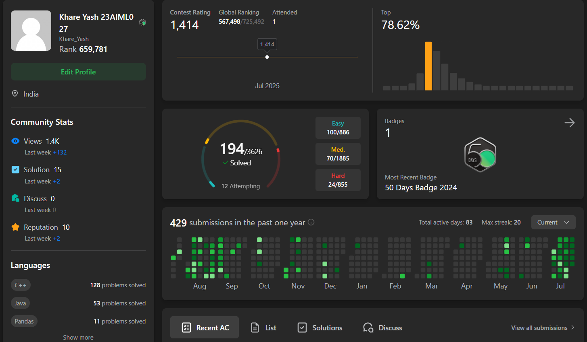
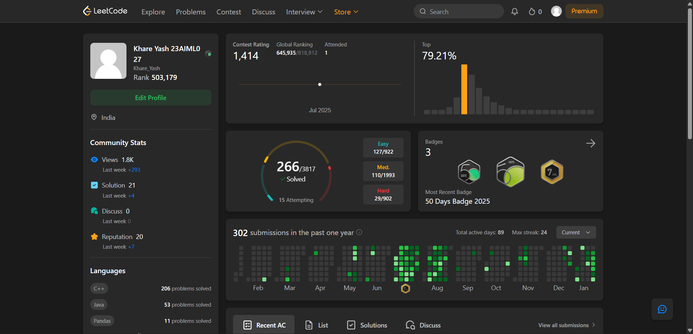

## Hello Leetcoders 👋👋
This is a public repo which i am using to be consistent in my coding skills and in leetcode contests i will be uploading regularly and consistently this repo is divided into the below file structure 
├── Year/  
&nbsp;&nbsp;&nbsp;&nbsp;&nbsp;&nbsp;&nbsp;&nbsp;&nbsp;&nbsp;&nbsp;&nbsp;├── Month's Daily Problems  
&nbsp;&nbsp;&nbsp;&nbsp;&nbsp;&nbsp;&nbsp;&nbsp;&nbsp;&nbsp;&nbsp;&nbsp;├── Contest Problems with Week  
&nbsp;&nbsp;&nbsp;&nbsp;&nbsp;&nbsp;&nbsp;&nbsp;&nbsp;&nbsp;&nbsp;&nbsp;└── Problems which I do while I am free  

This repository will help you (ig😅😅) to some extent and this is my initiative to be a consistent coder.
<h4>Happy Coding😄😄</h4>

# My LeetCode Progress till 24 July 2025

  

---

## Why to checkout this repository🤔🤔??
To make this repo public you can see the solutions of the problems which are in an organised way and you can also tell me how can i improve on some problems like how can i more optimise the solution.

---
## 🧠 Daily LeetCode Progress
Here, I solve problems daily to enhance my skills in data structures and algorithms.  
This journey is all about consistency, growth, and becoming a better problem solver. 💪

---
## Weekly Contest and Biweekly Contest Problem solutions
Here, I will be uploading (or try to upload as much as possible😅) weekly and biweekly contest solutions 

---
## Got the July Leetcoding Badge

---

## My LeetCode Progress till 22 Jan 2026

  
---

